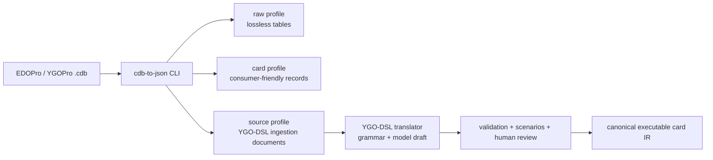
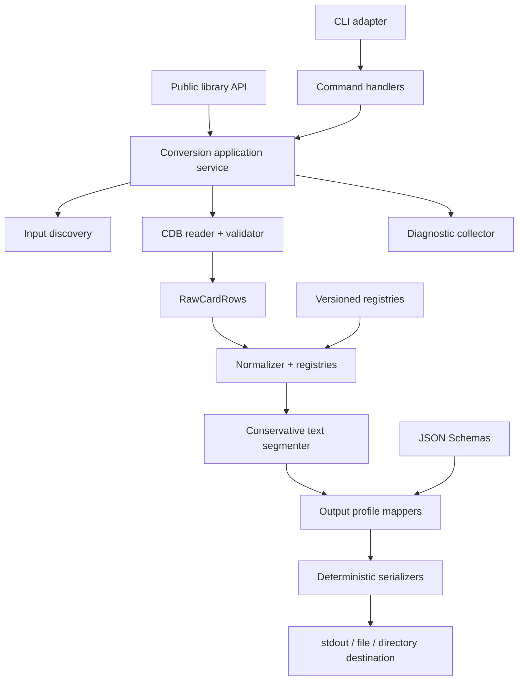

# Specification: Refactor `cdb-to-json` into a CLI-First Yu-Gi-Oh! Card Ingestion Tool

**Status:** Draft for implementation (with normative remediation delta in `docs/cdb-to-json-cli-refactor/senior-remediation-spec.md`)
**Repository:** `lynellf/cdb-to-json`
**Proposed release:** `2.0.0`
**Primary audience:** maintainers, data-pipeline authors, client developers, YGO-DSL tooling authors
**Normative words:** **MUST**, **MUST NOT**, **SHOULD**, and **MAY** are requirements terms.

---

## 1. Executive decision

Refactor `cdb-to-json` from a small directory-to-raw-tables library into a **CLI-first, library-backed card ingestion tool**.

The tool will continue to read EDOPro/YGOPro-compatible `.cdb` SQLite databases, but it will expose three explicit output profiles:

1. **`raw`** — a lossless representation of the source tables for compatibility and auditing;
2. **`card`** — one consumer-friendly card record per joined `datas`/`texts` row, with simulator bitfields decoded into printed-card concepts;
3. **`source`** — a provenance-rich source document designed to feed the YGO-DSL translation pipeline without pretending that CDB metadata is executable card semantics.

The CLI is an adapter over reusable core modules. Database extraction, bitfield decoding, text segmentation, profile mapping, serialization, and diagnostics MUST remain callable as a library and MUST NOT depend on terminal state or process-global logging.

The refactor is a major release because it introduces a stable CLI contract, versioned output schemas, and a new recommended output shape. The existing `1.x` default-export function will remain available through a deprecated compatibility wrapper during the `2.x` line.

---

## 2. Current repository assessment

The current repository is useful but deliberately narrow:

- the package exports one async function from `app/index.js`;
- input is assumed to be a directory;
- file discovery accepts names containing `.cdb`;
- every non-system SQLite table is loaded generically into memory;
- output is the raw table object, typically `{ datas, texts }`;
- files are written synchronously, with no output-directory creation or atomic-write policy;
- database lifecycle, logging, validation, normalization, and diagnostics are mixed into extraction;
- the only automated test asserts that a conversion completes without throwing.

The refactor MUST preserve the useful behavior—reading one or more CDB files and emitting JSON—while separating the following concerns:

```text
input discovery
  -> CDB schema validation
  -> lossless row extraction
  -> datas/texts join
  -> simulator-field decoding
  -> conservative card-text segmentation
  -> output-profile mapping
  -> deterministic serialization
  -> file/stdout delivery
```

---

## 3. Relationship to YGO-DSL

This tool is an **ingestion and normalization boundary**, not the DSL compiler.

It MAY:

- preserve exact imported CDB rows;
- decode simulator bitfields into typed enums;
- distinguish monster, spell, and trap printed fields;
- split explicitly marked Pendulum and Monster Effect sections;
- identify an unambiguous material/type line without interpreting it;
- attach source hashes, locale declarations, file provenance, and conversion diagnostics;
- produce a source document suitable for subsequent grammar, LLM-assisted, validation, and human-review stages.

It MUST NOT:

- infer executable effects from prose;
- translate PSCT punctuation into DSL operations;
- inspect or execute Lua scripts;
- decide rulings;
- infer archetype names from substrings;
- treat EDOPro `category` flags as authoritative semantic tags;
- publish canonical executable card artifacts.

The intended pipeline is:



---

## 4. Goals

The refactor MUST make the repository useful for:

- converting a single `.cdb`, a set of files, or a directory tree from a terminal;
- piping normalized cards to analysis scripts through stdout or JSON Lines;
- building database import jobs with deterministic, versioned records;
- generating client-friendly card catalogs without exposing raw bitmasks as the primary API;
- generating source records for the YGO-DSL pilot corpus;
- auditing every normalized value back to its source file and raw row;
- retaining unknown or newly introduced simulator values without silent data loss;
- consuming the same conversion logic programmatically.

### 4.1 Success criteria

1. A user can install the package and run `cdb-to-json convert cards.cdb` without writing JavaScript.
2. Every normalized record retains enough raw data and provenance to reproduce or audit the conversion.
3. The `card` profile contains no unexplained `type`, `race`, `level`, `setcode`, `ot`, or `category` integers at its primary domain surface.
4. Unknown bits and unsupported values are preserved and reported rather than discarded or guessed.
5. Identical inputs, options, registry versions, and tool versions produce byte-identical output.
6. JSON, JSON Lines, per-database, and stdout workflows are supported without loading the complete corpus into memory.
7. The source profile can be consumed directly by the first YGO-DSL translation stage.
8. Existing library consumers have a documented migration path and a compatibility wrapper.
9. Generated CDB integration fixtures cover all major card frames and malformed-row behavior.
10. CLI exit codes and machine-readable diagnostics are stable and tested.

---

## 5. Non-goals

Version 2 does not:

- merge card scripts or rulings into CDB records;
- guarantee that an English description is current official TCG text;
- resolve every `setcode` to a named archetype without a supplied registry;
- implement a card database server;
- download Project Ignis databases automatically;
- convert JSON back into CDB;
- edit CDB files;
- perform full PSCT parsing;
- produce deck legality or banlist status from `ot` alone;
- replace BabelCDB merge/delta tooling;
- bundle third-party card databases in the npm package.

---

## 6. Technology decisions

### ADR-CLI-001 — TypeScript, ESM, and no bundler

The implementation SHOULD use:

- Node.js 22 or newer;
- TypeScript in strict mode;
- native ESM;
- `tsc` for compilation;
- `better-sqlite3` as the SQLite reader;
- `node:util.parseArgs` for argument parsing;
- JSON Schema draft 2020-12 for output contracts;
- Vitest for unit, integration, and CLI tests.

A bundler is unnecessary. `better-sqlite3` remains an external native dependency, and the compiled package should preserve ordinary ESM modules for debuggability.

### ADR-CLI-002 — CLI-first does not mean CLI-coupled

The CLI layer MUST parse arguments, create a logger, invoke application services, and map diagnostics to terminal output and exit codes. It MUST NOT contain CDB queries, bitmask logic, text parsing, or record mapping.

### ADR-CLI-003 — Lossless source before normalization

Every database row is first represented as a lossless raw value. Normalizers consume that raw representation and return a normalized value plus diagnostics. No decoder may overwrite the raw value it interprets.

### ADR-CLI-004 — Conservative text segmentation

Text segmentation labels only structures supported by exact markers or strong card-frame evidence. Ambiguous text remains unsplit. The converter never fabricates effect clauses.

### ADR-CLI-005 — Versioned registries, not scattered constants

Type, attribute, monster-type, link-arrow, availability, category, and setcode decoding MUST use named, versioned registry modules. Unknown bits remain in `unknownBits` fields.

---

## 7. CLI contract

The installed binary is `cdb-to-json`.

```text
cdb-to-json <command> [inputs...] [options]
```

### 7.1 Commands

#### `convert`

Convert one or more CDB inputs into a selected output profile.

```bash
cdb-to-json convert ./cards.cdb
cdb-to-json convert ./databases --profile card --output ./out
cdb-to-json convert ./cards.cdb --profile source --format jsonl --output cards.ndjson
cdb-to-json convert ./base.cdb ./overrides.cdb --merge --on-conflict last -o catalog.json
```

#### `inspect`

Read metadata without emitting cards.

```bash
cdb-to-json inspect ./cards.cdb
cdb-to-json inspect ./databases --recursive --diagnostics json
```

The report includes:

- absolute or display-safe source path;
- file size and SHA-256;
- tables and columns;
- `datas` and `texts` row counts;
- orphaned row counts;
- duplicate/collision summary across inputs;
- decoded-value warnings, such as unknown type bits;
- detected locale only when explicitly supplied or provable.

#### `validate`

Validate input database structure and row-level invariants without writing converted output.

```bash
cdb-to-json validate ./cards.cdb --strict
```

#### `schema`

Print or write the JSON Schema for an output profile.

```bash
cdb-to-json schema card
cdb-to-json schema source --output ygo-card-source.schema.json
```

### 7.2 Common input options

| Option | Meaning | Default |
|---|---|---|
| `--recursive` | Traverse supplied directories recursively | `false` |
| `--exclude <glob>` | Exclude matching paths; repeatable | none |
| `--follow-symlinks` | Traverse symbolic links | `false` |
| `--locale <tag>` | Declare source-text locale, such as `en` | unset |
| `--source-namespace <name>` | Namespace for external identifiers | `konami` for numeric passcodes, configurable |
| `--strict` | Convert warnings designated as strict failures into errors | `false` |

Only files whose final extension is `.cdb`, case-insensitively, are accepted. A filename merely containing `.cdb` is not sufficient.

Input discovery MUST be deterministic:

1. preserve top-level command-line argument order;
2. sort files discovered within each directory by normalized relative path;
3. do not depend on filesystem enumeration order;
4. do not follow symlinks unless requested.

### 7.3 Conversion options

| Option | Values | Default |
|---|---|---|
| `--profile` | `raw`, `card`, `source` | `card` |
| `--format` | `json`, `jsonl` | `json` |
| `--output`, `-o` | file, directory, or `-` for stdout | stdout when one logical output exists |
| `--split` | `none`, `database`, `card` | `database` for multiple unmerged inputs; otherwise `none` |
| `--merge` | combine card rows from all inputs | `false` |
| `--on-conflict` | `error`, `first`, `last` | `error` |
| `--pretty` | indented JSON | `false` |
| `--force` | replace existing output | `false` |
| `--include-raw` | embed complete raw rows in normalized profiles | `true` for `source`, `false` for `card` |
| `--setcode-registry <path>` | resolve numeric setcodes through a pinned registry | none |
| `--availability-registry <path>` | override or extend `ot` decoding | built-in versioned registry |
| `--diagnostics` | `text`, `json`, `jsonl`, `none` | `text` |
| `--continue-on-error` | process later databases after a database-level failure | `false` |
| `--max-staging-bytes` | aggregate private staging/reservation budget | `4 GiB` |
| `--max-snapshot-bytes` | maximum source main/WAL/SHM snapshot and materialization bytes | `4 GiB` |

### 7.4 Stdout and stderr

- Converted data written to stdout MUST contain data only.
- Human diagnostics, progress, and warnings MUST go to stderr.
- Progress output MUST be disabled when stderr is not a TTY unless explicitly requested.
- `--diagnostics json` and `jsonl` MUST use a documented stable diagnostic envelope.
- Library modules MUST NOT call `console.log` or `console.error`.

### 7.5 Output path behavior

- The CLI creates missing output directories.
- Existing files are not replaced unless `--force` is supplied.
- File writes use a temporary sibling file followed by an atomic rename where supported.
- A failed conversion MUST NOT leave a truncated destination file.
- Multiple logical outputs require an output directory unless `--split none --merge` produces one stream.
- File and directory destinations are atomic per logical output under a finite aggregate staging budget. Stdout is intentionally non-atomic streaming: it is allowed only for one logical output, and late failures may leave prior bytes already emitted.
- Aggregate card/source JSON arrays use named schemas `cdb.card-array/2` and `ygo.card-source-array/1`; item schemas remain `cdb.card/2` and `ygo.card-source/1`. Raw JSON is one `cdb.raw/1` envelope. The `schema` command exposes item and aggregate schemas distinctly.

### 7.6 Exit codes

| Code | Meaning |
|---:|---|
| `0` | Success with no errors |
| `1` | Unexpected internal failure |
| `2` | Invalid command or option combination |
| `3` | No usable CDB input found |
| `4` | Input schema or strict validation failure |
| `5` | Card-ID collision under `--on-conflict error` |
| `6` | Output conflict or write failure |
| `7` | Partial conversion under `--continue-on-error` |

Warnings alone do not change a successful exit code unless `--strict` promotes them.

---

## 8. CDB input contract

### 8.1 Required tables

A standard input contains:

```text
datas(id, ot, alias, setcode, type, atk, def, level, race, attribute, category)
texts(id, name, desc, str1 ... str16)
```

The converter MUST query these tables explicitly. It MUST NOT dynamically execute `SELECT *` against every arbitrary user-defined table.

The supported raw contract is the fixed standard `datas`/`texts` column set listed above. Extra tables and columns MAY be recorded as metadata (name, columns, and row count), but their cell values are not part of `cdb.raw/1` and MUST NOT be implied to be losslessly preserved. A future schema version may explicitly add safely quoted extraction for them. This supported-columns boundary is the meaning of “lossless raw” throughout this specification.

### 8.2 Database safety and lifecycle

- Open databases read-only with `fileMustExist` semantics.
- Close every database in `finally`, including failed conversions.
- Use fixed SQL statements or safely quoted known identifiers.
- Disable extension loading.
- Require and validate SQLite `UTF-8` database encoding before text-byte preflight; non-UTF-8 databases fail with a stable input diagnostic rather than being measured as UTF-8.
- Acquire a stable private snapshot of the main database and any present `-wal`/`-shm` members before opening. Read the snapshot read-only and verify its member identities/hashes before publication; a stable WAL bundle is supported, while an unstable bundle fails with `SOURCE_MUTATED_DURING_READ`.
- Apply resource limits to rows, text cells, each logical output, aggregate staging, and merge-private storage when configured.
- Never execute SQL stored inside a CDB value.

### 8.3 Join behavior

The normalized profiles are built from a full logical join on `datas.id = texts.id`.

- A complete pair creates one ordinary card record.
- A `datas` row without `texts` creates an incomplete record plus `MISSING_TEXT_ROW` unless strict mode rejects it. Its ID and data raw row remain present; name/text are null; data-derived typed surfaces are `UNKNOWN`/null rather than fabricated.
- A `texts` row without `datas` creates an incomplete record plus `MISSING_DATA_ROW` unless strict mode rejects it. Its ID, name, and exact text raw row remain present; data-derived typed surfaces are null and no placeholder card kind/stat is invented.
- Duplicate IDs within a table are a schema error.
- The card and source schemas explicitly permit and require these orphan null states, including absent-partner raw rows and missing-partner diagnostics.
- Before the join, `datas.id` and `texts.id` MUST be non-null SQLite INTEGER values in the signed 64-bit range; numeric-looking TEXT, REAL, BLOB, and NULL IDs fail with `INVALID_CARD_ID` rather than being coerced. IDs are canonical decimal strings and are ordered by signed numeric value (`2` precedes `10`); source ordinals are zero-based positions in that canonical-ID order, with the data branch before the text-orphan branch at a shared ID. This is independent of insertion order and is the total order used for joins, output, and hashes.

### 8.4 Multiple-database conflict behavior

Without `--merge`, every database remains an independent output source.

With `--merge`, records are processed in deterministic input order:

- `error` stops on the first repeated card ID;
- `first` retains the first record and records later sources as ignored collisions;
- `last` retains the last record and records the replaced source lineage.

A merged record MUST retain all contributing source references. Silent replacement is forbidden.

---

## 9. Output profiles

## 9.1 `raw` profile

Schema identifier: `cdb.raw/1`

Purpose: lossless extraction, debugging, compatibility, and future re-normalization.

```json
{
  "schema": "cdb.raw/1",
  "source": {
    "fileName": "cards.cdb",
    "sha256": "sha256:...",
    "sizeBytes": 123456,
    "converter": "cdb-to-json/2.0.0"
  },
  "tables": {
    "datas": [],
    "texts": []
  },
  "extraTables": {}
}
```

Rules:

- Preserve source integers and strings exactly as returned by SQLite.
- Preserve `str1` through `str16`, including empty strings and `null` values.
- Do not decode, rename, or omit a supported standard source column; every supported SQLite INTEGER is represented as a signed-int64 decimal string and every supported TEXT/NULL value is retained exactly.
- The `extraTables` metadata is intentionally not a cell-value dump; values outside the supported standard column set are out of contract, not silently claimed as lossless.
- `--split database` plus `--profile raw` is the supported replacement for the current per-CDB JSON output.

## 9.2 `card` profile

Schema identifier: `cdb.card/2`

Purpose: client applications, ordinary analysis, search indexing, and database imports.

For incomplete joins, `id` and `identity.externalIds` remain populated from the valid present row. A datas-only record has `name: null`, `text.raw: null`, null/unknown data-derived convenience fields, and an absent texts raw row; a texts-only record retains name/text and has null data-derived convenience fields and an absent datas raw row. Both retain the missing-partner diagnostic and are schema-valid. No placeholder card kind, stat, or effect is fabricated.

```json
{
  "schema": "cdb.card/2",
  "id": "16178681",
  "name": "Odd-Eyes Pendulum Dragon",
  "locale": "en",
  "cardKind": "MONSTER",
  "traits": ["EFFECT", "PENDULUM"],
  "typeLine": {
    "monsterType": "DRAGON",
    "abilities": ["PENDULUM", "EFFECT"],
    "display": "Dragon / Pendulum / Effect"
  },
  "monster": {
    "attribute": "DARK",
    "level": 7,
    "rank": null,
    "linkRating": null,
    "attack": 2500,
    "defense": 2000,
    "pendulum": {
      "leftScale": 4,
      "rightScale": 4
    },
    "linkArrows": []
  },
  "spell": null,
  "trap": null,
  "text": {
    "raw": "...",
    "material": null,
    "pendulumEffect": "...",
    "monsterEffect": "...",
    "spellTrapEffect": null,
    "flavor": null,
    "segmentation": "EXACT_MARKERS"
  },
  "identity": {
    "externalIds": [
      { "namespace": "konami", "value": "16178681" }
    ],
    "aliasOf": null,
    "alternateArtworkOf": null
  },
  "archetypes": {
    "codes": [4660],
    "resolved": [],
    "unresolved": [4660]
  },
  "simulator": {
    "availability": {
      "codes": [],
      "unknownBits": "0x0"
    },
    "categoryFlags": {
      "codes": [],
      "unknownBits": "0x0"
    },
    "auxiliaryStrings": []
  },
  "source": {
    "kind": "EDOPRO_CDB",
    "databaseSha256": "sha256:...",
    "databaseFileName": "cards.cdb",
    "rowId": "16178681",
    "converter": "cdb-to-json/2.0.0",
    "normalizationRegistry": "cdb-normalization/1"
  },
  "diagnostics": []
}
```

The example is structural; actual card values come only from the input database and declared registries.

## 9.3 `source` profile

Schema identifier: `ygo.card-source/1`

Purpose: the source-document layer of the YGO-DSL translation pipeline.

For incomplete joins, `printed.name` and text raw/normalized values may be null, `printed.cardKind` is `UNKNOWN`, typed printed surfaces are null, and `simulatorSource.rawRows` explicitly marks the missing partner. The missing-partner diagnostic is retained; source output remains `SOURCE_ONLY` and never invents executable meaning.

It contains the `card` profile’s normalized printed facts plus exact provenance and raw rows:

```json
{
  "schema": "ygo.card-source/1",
  "sourceRevisionId": "sha256:...",
  "identity": {
    "externalIds": [
      { "namespace": "konami", "value": "16178681" }
    ],
    "aliasOf": null
  },
  "locale": "en",
  "printed": {
    "name": "Odd-Eyes Pendulum Dragon",
    "cardKind": "MONSTER",
    "traits": ["EFFECT", "PENDULUM"],
    "monster": {
      "monsterType": "DRAGON",
      "attribute": "DARK",
      "level": 7,
      "attack": 2500,
      "defense": 2000,
      "pendulum": { "leftScale": 4, "rightScale": 4 }
    }
  },
  "text": {
    "raw": "...",
    "sections": {
      "material": null,
      "pendulumEffect": "...",
      "monsterEffect": "..."
    },
    "sourceSpans": []
  },
  "simulatorSource": {
    "ecosystem": "EDOPRO",
    "database": {
      "fileName": "cards.cdb",
      "sha256": "sha256:..."
    },
    "rawRows": {
      "datas": {},
      "texts": {}
    },
    "decoded": {
      "setcodes": [],
      "availability": {},
      "categoryFlags": {},
      "auxiliaryStrings": []
    }
  },
  "references": {
    "scripts": [],
    "rulings": []
  },
  "coverage": {
    "status": "SOURCE_ONLY",
    "assumptions": [],
    "unsupported": []
  },
  "provenance": {
    "converter": "cdb-to-json/2.0.0",
    "normalizationRegistry": "cdb-normalization/1",
    "conversionOptionsHash": "sha256:..."
  },
  "diagnostics": []
}
```

`SOURCE_ONLY` explicitly means that no executable DSL semantics have been authored or reviewed yet.

---

## 10. Field normalization contract

| CDB field | Normalized field | Rule |
|---|---|---|
| `datas.id` | `id`, `identity.externalIds[]` | Encode as a decimal string; never use a localized name as identity |
| `texts.name` | `name`, `printed.name` | Preserve exact source text and Unicode; optionally NFC-normalize the normalized copy |
| `texts.desc` | `text.raw` | Preserve exactly; normalized line endings may be stored separately |
| `texts.str1..str16` | `simulator.auxiliaryStrings[]` | Preserve index and value; these are simulator/script hints, not printed card effects |
| `datas.type` | `cardKind`, `traits`, spell/trap subtype | Decode all known flags; retain `rawValue` and `unknownBits` |
| `datas.race` | `monster.monsterType` | Use printed-card term `monsterType`; support unknown and multi-bit values without guessing |
| `datas.attribute` | `monster.attribute` | Decode known attribute flags; preserve unknown bits |
| `datas.level` | level/rank/link rating and Pendulum scales | Unpack through a versioned decoder; select level/rank/link field using decoded card traits |
| `datas.atk` | `monster.attack` | Use integer when known; map sentinel/unknown values to `null` while retaining raw integer |
| `datas.def` | defense or Link arrows | For Link monsters, decode marker bits and set defense to `null`; otherwise decode defense sentinel/value |
| `datas.setcode` | `archetypes.codes[]` | Unpack ordered 16-bit codes; resolve names only through a supplied/pinned registry |
| `datas.alias` | `identity.aliasOf` | Zero becomes `null`; do not silently equate alias with official errata identity |
| `datas.ot` | `simulator.availability` | Decode through a versioned registry; do not call it a banlist or legality field |
| `datas.category` | `simulator.categoryFlags` | Keep simulator search categories outside printed semantics and DSL effect tags |

### 10.1 Card kind and traits

The decoder MUST distinguish:

- `MONSTER`;
- `SPELL`;
- `TRAP`;
- explicitly supported special records such as tokens or skills;
- `UNKNOWN` when no supported primary kind can be established.

Monster traits include, as applicable:

- `NORMAL`, `EFFECT`, `RITUAL`, `FUSION`, `SYNCHRO`, `XYZ`, `LINK`, `PENDULUM`;
- `TUNER`, `FLIP`, `GEMINI`, `UNION`, `SPIRIT`, `TOON`, `TOKEN`;
- other registry-defined traits.

Spell/trap subtype is represented as one typed field rather than a free-form combination:

- spell: `NORMAL`, `RITUAL`, `QUICK_PLAY`, `CONTINUOUS`, `EQUIP`, `FIELD`;
- trap: `NORMAL`, `CONTINUOUS`, `COUNTER`.

Impossible or conflicting flag combinations produce diagnostics and retain the complete decoded flag list.

### 10.2 Packed level data

The level decoder MUST expose a typed result rather than leaking packed bytes:

```ts
type DecodedProgression = {
  level: number | null;
  rank: number | null;
  linkRating: number | null;
  pendulum: { leftScale: number; rightScale: number } | null;
  rawValue: number;
  unknownBits: string;
};
```

The exact bit layout is owned by `cdb-normalization/1` and covered by golden fixtures. Consumers MUST NOT duplicate bit shifts.

### 10.3 Stats and sentinels

Known attack/defense values are integers. Simulator sentinel values become `null` in the friendly surface and remain available as raw fields.

```ts
type PrintedStat = {
  value: number | null;
  display: string | null;
  rawValue: number;
};
```

The CLI MUST NOT invent `0` for unknown attack or defense.

### 10.4 Setcodes

A packed `setcode` is decoded into numeric identifiers in source order. The converter does not know canonical archetype names unless a registry is supplied.

```ts
type ArchetypeReference = {
  code: number;
  identity?: string;
  name?: string;
  registryHash?: string;
};
```

Registry files are immutable, schema-versioned, and content-hashed. An unresolved code remains in output.

### 10.5 Alias and alternate artwork

`alias` is preserved as a simulator relationship. A separate `alternateArtworkOf` MAY be derived only by a named policy, such as a pinned Project Ignis alias-distance rule. The source value and derivation policy must remain visible.

### 10.6 `ot` and availability

The tool uses the neutral term `availability`, because `ot` can encode region/source/product states and does not by itself prove current tournament legality.

```ts
type AvailabilityDecode = {
  rawValue: number;
  codes: readonly string[];
  unknownBits: string;
  registry: string;
};
```

### 10.7 Category flags

`category` remains simulator metadata. It MUST NOT populate DSL effect tags such as `search`, `removal`, or `negation` without an independent semantic derivation step.

---

## 11. Card-text segmentation

The converter preserves two forms:

- `raw`: exact imported description;
- `normalized`: normalized line endings and optionally Unicode NFC.

It MAY derive sections:

```ts
type CardTextSections = {
  material: TextSlice | null;
  pendulumEffect: TextSlice | null;
  monsterEffect: TextSlice | null;
  spellTrapEffect: TextSlice | null;
  flavor: TextSlice | null;
  unclassified: readonly TextSlice[];
  segmentation:
    | "EXACT_MARKERS"
    | "FRAME_RULE"
    | "UNSPLIT"
    | "PARTIAL";
};

type TextSlice = {
  text: string;
  start: number;
  end: number;
  basis: string;
};
```

### 11.1 Permitted rules

- Exact `[ Pendulum Effect ]` / `[ Monster Effect ]` markers may split Pendulum text.
- A Normal Monster description may be labeled `flavor` based on the decoded frame.
- Spell and Trap descriptions may be labeled `spellTrapEffect` based on card kind.
- A first-line material declaration may be labeled `material` only for an eligible Extra Deck/Ritual frame and only when a tested structural rule matches.
- Remaining text stays in `unclassified` rather than being guessed.

### 11.2 Forbidden rules

The converter MUST NOT:

- split effects merely at periods;
- infer costs, targets, conditions, or resolution;
- translate colon/semicolon punctuation;
- classify `if` versus `when` triggers;
- infer once-per-turn scope;
- create executable operation names.

Those belong to the YGO-DSL translator.

---

## 12. Determinism and canonical output

For the same inputs and options:

- source discovery order is deterministic;
- card records are deterministically ordered;
- object property order follows the profile serializer contract;
- line endings are `\n`;
- pretty-printing uses two spaces;
- JSON Lines emits one compact JSON object plus `\n` per record;
- timestamps are excluded unless explicitly requested as noncanonical metadata;
- absolute machine-local paths are excluded from canonical hashes;
- source file hashes use lowercase SHA-256 identifiers;
- conversion-option hashes exclude output path and presentation-only flags.

`sourceRevisionId` is computed from a documented canonical serialization of the lossless supported source facts, locale declaration, source namespace, verified database-bundle hash, canonical row identity/ordinals, all registry content hashes, text-normalization version, and the complete semantic conversion-options object. `conversionOptionsHash` hashes that same semantic-options object (including locale and source namespace) without source facts. Neither hash changes because output was pretty-printed, emitted as JSON versus JSONL, or written to a different path.

---

## 13. Streaming and performance

The converter SHOULD process card rows through `better-sqlite3` iterators rather than materializing the entire database.

```text
SQLite row iterator
  -> join/decode
  -> profile mapper
  -> serializer
  -> output stream
```

Requirements:

- `jsonl` streams one record at a time;
- a JSON array writer streams delimiters and records without collecting all cards;
- per-card output writes one record at a time;
- source-file SHA-256 is computed through a file stream;
- databases are processed sequentially in v2 unless measured evidence justifies worker concurrency;
- output backpressure is honored;
- cancellation closes database handles and removes temporary files.

Provisional performance target on ordinary development hardware:

- convert a standard full card database to compact `card` JSON in under 10 seconds;
- peak JavaScript heap below 256 MiB for JSON/JSONL streaming;
- no result differences between streamed and collected test adapters.

Performance targets are subordinate to correctness and should be benchmarked before being made release gates.

---

## 14. Library API

The package remains usable without spawning the CLI.

```ts
export type ConvertOptions = {
  inputs: readonly string[];
  profile?: "raw" | "card" | "source";
  format?: "json" | "jsonl";
  merge?: boolean;
  onConflict?: "error" | "first" | "last";
  locale?: string;
  sourceNamespace?: string;
  includeRaw?: boolean;
  strict?: boolean;
  limits?: LimitsV1;
  signal?: AbortSignal;
  registries?: RegistryConfig;
};

export type ConversionReport = {
  sources: readonly SourceReport[];
  cardCount: number;
  warningCount: number;
  errorCount: number;
  output?: OutputReport;
};

export async function convert(
  options: ConvertOptions & { destination: ConversionDestination },
): Promise<ConversionReport>;

export type ReadOptions = {
  signal?: AbortSignal;
  limits?: LimitsV1;
  strict?: boolean;
};

export function iterateRawCards(
  databasePath: string,
  options?: ReadOptions,
): AsyncIterableIterator<RawCardRows>;

export function normalizeCard(
  rows: RawCardRows,
  context: NormalizationContext,
): NormalizationResult<CardRecord>;

export function toSourceDocument(
  card: CardRecord,
  context: SourceDocumentContext,
): NormalizationResult<CardSourceDocument>;
```

### 14.1 Compatibility wrapper

During the `2.x` line:

```ts
/** @deprecated Use convert() with profile: "raw". */
export default function legacyConvert(
  inputDir: string,
  outputDir?: string,
  options?: { emit?: boolean; ignore?: string[] },
): Promise<LegacyTableResult[] | void>;
```

The wrapper reproduces the old logical return shape, but uses the new discovery, lifecycle, and writer internals. Deprecation warnings are documentation-level by default and MUST NOT pollute stdout.

### 14.2 Package exports

```json
{
  "type": "module",
  "bin": {
    "cdb-to-json": "./dist/cli.js"
  },
  "exports": {
    ".": {
      "types": "./dist/index.d.ts",
      "import": "./dist/index.js"
    },
    "./schemas/*": "./schemas/*"
  },
  "files": ["dist", "schemas", "README.md", "LICENSE"]
}
```

---

## 15. Diagnostics

```ts
type Diagnostic = {
  code: DiagnosticCode;
  severity: "INFO" | "WARNING" | "ERROR";
  message: string;
  source?: {
    database?: string;
    table?: "datas" | "texts";
    cardId?: string;
    column?: string;
  };
  rawValue?: unknown;
  details?: Readonly<Record<string, unknown>>;
};
```

Minimum stable codes:

- `NO_CDB_INPUT`;
- `CDB_OPEN_FAILED`;
- `MISSING_REQUIRED_TABLE`;
- `MISSING_REQUIRED_COLUMN`;
- `DUPLICATE_CARD_ID`;
- `MISSING_DATA_ROW`;
- `MISSING_TEXT_ROW`;
- `CARD_ID_COLLISION`;
- `UNKNOWN_TYPE_BITS`;
- `UNKNOWN_ATTRIBUTE_BITS`;
- `UNKNOWN_MONSTER_TYPE_BITS`;
- `UNKNOWN_LINK_MARKER_BITS`;
- `UNKNOWN_AVAILABILITY_BITS`;
- `UNKNOWN_CATEGORY_BITS`;
- `INVALID_PACKED_LEVEL`;
- `INVALID_PACKED_SETCODE`;
- `AMBIGUOUS_TEXT_SEGMENTATION`;
- `OUTPUT_EXISTS`;
- `OUTPUT_WRITE_FAILED`;
- `INVALID_CARD_ID`;
- `INVALID_INTEGER_VALUE`;
- `UNSUPPORTED_DATABASE_ENCODING`;
- `SOURCE_MUTATED_DURING_READ`;
- `RESOURCE_LIMIT_EXCEEDED`;
- `CANCELLED`.

Errors should identify source facts without dumping an entire card description or local secret path into logs.

---

## 16. Proposed architecture



### 16.1 Dependency rule

Dependencies flow inward:

```text
cli -> application -> domain
                 -> adapters/sqlite
                 -> adapters/filesystem
```

Domain modules do not import CLI, filesystem, terminal, or database objects.

---

## 17. Proposed project structure

```text
src/
  cli.ts
  cli/
    parseArgs.ts
    renderHelp.ts
    renderDiagnostics.ts
    exitCodes.ts
  commands/
    convert.ts
    inspect.ts
    validate.ts
    schema.ts
  application/
    convertCatalog.ts
    inspectInputs.ts
    validateInputs.ts
    mergeRecords.ts
  discovery/
    discoverCdbInputs.ts
    pathPolicy.ts
  cdb/
    openDatabase.ts
    inspectSchema.ts
    iterateRows.ts
    rawTypes.ts
  normalization/
    normalizeCard.ts
    decodeType.ts
    decodeProgression.ts
    decodeStats.ts
    decodeSetcodes.ts
    decodeAvailability.ts
    decodeCategory.ts
    registries/
      cardTypes.v1.ts
      attributes.v1.ts
      monsterTypes.v1.ts
      linkMarkers.v1.ts
      availability.v1.ts
      categories.v1.ts
  text/
    normalizeText.ts
    segmentCardText.ts
    markerRules.ts
  profiles/
    rawProfile.ts
    cardProfile.ts
    sourceProfile.ts
  serialization/
    jsonArrayWriter.ts
    jsonLinesWriter.ts
    canonicalJson.ts
  destinations/
    stdoutDestination.ts
    fileDestination.ts
    directoryDestination.ts
    atomicFile.ts
  diagnostics/
    codes.ts
    collector.ts
  hashing/
    sha256.ts
  index.ts
  legacy.ts
schemas/
  cdb.raw.v1.schema.json
  cdb.card.v2.schema.json
  ygo.card-source.v1.schema.json
tests/
  fixtures/
    generated/
    expected/
  unit/
  integration/
  cli/
  conformance/
benchmarks/
  convert-full-cdb.ts
docs/
  output-profiles.md
  registry-versioning.md
  migration-v1-to-v2.md
```

---

## 18. Test strategy

### 18.1 Generated CDB fixtures

Tests SHOULD create temporary SQLite CDB files programmatically so fixtures are small, inspectable, and license-safe.

Minimum card cases:

- Normal Monster with flavor text;
- ordinary Effect Monster;
- Ritual Monster;
- Fusion Monster with material line;
- Synchro Monster;
- Xyz Monster using rank;
- Pendulum Effect Monster with exact section markers and scales;
- Link Monster with link rating and arrows but no defense;
- Normal, Ritual, Quick-Play, Continuous, Equip, and Field Spells;
- Normal, Continuous, and Counter Traps;
- Token, skill, unofficial, and pre-release-style rows;
- unknown type/attribute/monster-type bits;
- unknown attack/defense sentinel;
- missing `datas` or `texts` partner;
- malformed packed setcode;
- conflicting IDs across two databases.

### 18.2 Unit tests

- every known registry flag decodes independently and in combinations;
- decode/re-encode property tests preserve known and unknown bits;
- packed level/scales/link data has golden vectors;
- setcode unpacking preserves order and zero termination;
- text segmentation preserves exact source spans;
- no text rule emits DSL semantics;
- profile mappers satisfy their JSON Schemas.

### 18.3 Integration tests

- single file to stdout;
- directory to per-database outputs;
- JSON and JSONL equivalence;
- merged conflict policies;
- output directory creation;
- atomic-write cleanup after injected failure;
- strict versus non-strict diagnostics;
- raw profile retains every source value;
- source revision IDs are deterministic;
- database handles close on success and failure.

### 18.4 CLI tests

Spawn the compiled binary and assert:

- help and version output;
- exit codes;
- stdout contains no logs;
- stderr contains expected diagnostics;
- invalid option combinations fail before opening databases;
- `-o -` behaves as stdout;
- existing outputs require `--force`;
- SIGINT removes partial temporary files.

### 18.5 Compatibility tests

The legacy wrapper receives the existing test fixture and returns the previous logical structure. A golden test compares `1.x` and `2.x` raw table content while permitting intentional improvements in whitespace and error text.

---

## 19. Security and robustness

- Treat CDBs as untrusted SQLite files.
- Open read-only and never enable extensions.
- Query only known tables and columns.
- Bound text length, row count, and output size under configurable limits.
- Avoid absolute path disclosure in canonical output and user-facing errors by default.
- Do not write outside the selected output root after path normalization.
- Reject output paths that collide with an input file.
- Do not follow symlinks by default.
- Do not interpret descriptions, names, or auxiliary strings as shell commands, SQL, paths, or model instructions.
- Preserve raw text as data and escape it only through the selected serializer.

---

## 20. Delivery plan

### Phase 0 — Contract and fixtures

Define:

- the three output schemas;
- field names and enum casing;
- normalization registries;
- generated CDB fixtures;
- golden normalized records;
- CLI help and exit-code contract.

**Gate:** schemas validate the golden records, and each packed-field rule has at least one test vector.

### Phase 1 — Extract a clean CDB reader

Refactor the current code into input discovery, read-only DB lifecycle, explicit schema inspection, row iterators, and diagnostics while retaining the old raw behavior.

**Gate:** the compatibility test passes, handles close correctly, and arbitrary tables are not queried.

### Phase 2 — Ship the CLI and raw profile

Add `convert`, `inspect`, `validate`, and `schema`, plus stdout/file destinations and atomic writes.

**Gate:** the CLI can replace the current README workflow using `--profile raw`.

### Phase 3 — Add the card profile

Implement type, attribute, monster type, level/rank/link, stat, setcode, availability, category, alias, and auxiliary-string normalization.

**Gate:** all major card-frame fixtures produce stable, schema-valid records with no unexplained primary-surface integers.

### Phase 4 — Add text segmentation and source profile

Implement conservative card-text sections, source hashes, raw-row embedding, coverage markers, and DSL-oriented source documents.

**Gate:** a selected 50–100-card pilot can be handed to the YGO-DSL translator without a bespoke CDB adapter.

### Phase 5 — Hardening and `2.0.0`

Add migration documentation, performance benchmarks, package exports, CI matrices, npm packing tests, and end-to-end conversion of representative BabelCDB files.

**Gate:** package install, CLI execution, library import, schema export, and deterministic-output checks pass on supported Node platforms.

---

## 21. Initial implementation backlog

- [ ] Introduce TypeScript configuration and `src/` without changing behavior.
- [ ] Add generated SQLite fixture helpers.
- [ ] Define raw CDB row types and schema-inspection diagnostics.
- [ ] Replace generic table enumeration with explicit `datas`/`texts` queries.
- [ ] Open read-only and close database handles in `finally`.
- [ ] Replace directory-only discovery with file/directory input discovery.
- [ ] Add `convert --profile raw` and atomic output destinations.
- [ ] Add `inspect`, `validate`, and `schema` commands.
- [ ] Define versioned card-type, attribute, monster-type, and link-arrow registries.
- [ ] Implement packed progression and stat decoders.
- [ ] Implement setcode, alias, availability, category, and auxiliary-string mapping.
- [ ] Implement `cdb.card/2` mapper and JSON Schema.
- [ ] Implement conservative text segmentation with source spans.
- [ ] Implement `ygo.card-source/1` mapper and source-revision hashing.
- [ ] Add merge conflict policies with provenance.
- [ ] Add JSONL streaming and streamed JSON arrays.
- [ ] Add the deprecated `1.x` compatibility wrapper.
- [ ] Rewrite README around CLI-first usage and include a migration guide.
- [ ] Add CI for build, tests, npm package contents, and CLI smoke installation.

---

## 22. Risks and mitigations

| Risk | Mitigation |
|---|---|
| EDOPro adds new bits or repurposes fields | Version registries; preserve raw integers and unknown bits; add fixture before mapping |
| Friendly output silently invents card semantics | Keep normalization structural; forbid PSCT/DSL inference; retain diagnostics and raw source |
| Text-section heuristics split cards incorrectly | Exact markers first; conservative frame rules; source spans; `UNSPLIT` fallback |
| `setcode` names become stale or incorrect | Require external content-addressed registry; never infer by substring |
| `ot` is misrepresented as legality | Use neutral availability model and expose registry provenance |
| Multiple CDBs replace cards silently | Default conflict policy `error`; explicit first/last options with source lineage |
| Large catalogs exhaust memory | Iterator-based reads and streaming writers |
| Native SQLite dependency complicates installation | Keep one SQLite dependency; test npm packaging on supported Node/OS matrix |
| Schema changes break downstream clients | Version profile schemas independently and use a major release for incompatible defaults |
| Source data licensing is confused with tool licensing | Do not bundle databases; retain source provenance; document that generated data inherits source obligations |
| DSL work starts depending on converter heuristics as truth | Mark source output `SOURCE_ONLY`; require translator validation and human review downstream |

---

## 23. Open questions and recommended defaults

1. **Should the CLI default to `card` or `raw`?**
   **Recommended:** `card`. Version 2 exists to expose a consumer-oriented interface; `raw` remains explicit and compatible.

2. **Should one file without `--output` write to stdout?**
   **Recommended:** yes. It supports shell pipelines and keeps diagnostics separate on stderr.

3. **Should multiple files merge by default?**
   **Recommended:** no. Require `--merge` so override precedence is never accidental.

4. **What is the default collision policy under `--merge`?**
   **Recommended:** `error`. Users reproducing EDOPro overlay behavior can explicitly choose `last` and control input order.

5. **Should IDs be numbers or strings?**
   **Recommended:** strings. Passcodes are identifiers, prerelease/custom ranges vary, and consumers should not perform arithmetic on them.

6. **Should raw rows be embedded in the `card` profile?**
   **Recommended:** no by default; include provenance and decoded raw values. Use `--include-raw` when needed. The `source` profile includes them by default.

7. **Should `source` be named `ygo.card-source/1` immediately?**
   **Recommended:** yes, provided the DSL repository adopts the schema as its source-document contract. Otherwise publish it temporarily as `cdb.card-source/1` and supply a lossless adapter.

8. **Should the tool resolve archetype names itself?**
   **Recommended:** only through a supplied, pinned registry file. Numeric setcodes alone are the lossless source fact.

9. **Should the converter parse material lines?**
   **Recommended:** label only exact, tested structural cases and preserve an `UNSPLIT` fallback. Do not semantically parse material requirements here.

10. **Should the old default export survive indefinitely?**
    **Recommended:** retain it through `2.x`, document migration, and remove it in `3.0` only after known consumers move.

---

## 24. Boundaries

### Always

- Preserve source values and provenance.
- Decode through versioned registries.
- Emit deterministic order and hashes.
- Keep CLI and core library separate.
- Use typed diagnostics instead of ad hoc console output.
- Treat unknown bits as data, not as zero.
- Make source-only versus executable semantics explicit.

### Ask first

- Add a new normalized field not derivable from the CDB or a declared registry.
- Change enum casing or schema identifiers.
- Change collision precedence.
- Interpret a new description marker.
- Promote a simulator category into a semantic tag.
- Change source-revision hash contents.
- Remove the legacy API.

### Never

- Execute Lua, SQL from values, or card text.
- Guess a ruling or DSL operation.
- Drop unknown bits silently.
- Call `console.log` from core modules.
- overwrite output without explicit permission.
- merge duplicate IDs silently.
- claim that `ot` equals current tournament legality.
- claim that a CDB description is authoritative for every locale/ruleset.

---

## 25. Final recommendation

Approve the refactor as a `2.0.0` CLI-first release with the following implementation order:

1. extract and test the lossless CDB reader;
2. ship the CLI using the raw profile;
3. implement the friendly card schema and packed-field registries;
4. add conservative text segmentation;
5. add the provenance-rich YGO-DSL source profile;
6. run the first 50–100-card DSL pilot from that source output before expanding the converter’s semantic ambitions.

The crucial product boundary is that this repository should become excellent at answering **“what source facts does this CDB contain, and how do they map to printed-card concepts?”** It should deliberately stop before answering **“what executable effect does this card implement?”** That separation gives the DSL effort a trustworthy, repeatable input corpus without turning a focused conversion tool into a second rules engine or an unreliable text-to-semantics parser.
